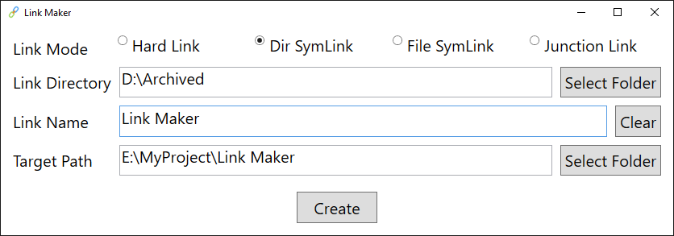

# Link Maker 

[![Button Discord]][Discord]
[![Buttons Download]][Download]

Link Maker let you make a link easily on Windows.

See [mklink](https://learn.microsoft.com/en-us/windows-server/administration/windows-commands/mklink) to learn more. 

## Acknowledgements

<!----------------------------------------------------------------------------->

[Discord]: https://discord.gg/PDwyxM3waw

[Download]: https://github.com/liplum/LinkMaker/releases/latest

[Button Discord]: https://img.shields.io/discord/937228972041842718?color=454fc1&label=Discord&logo=Discord&style=for-the-badge&logoColor=white&labelColor=5865F2

[Buttons Download]: https://img.shields.io/github/downloads/liplum/LinkMaker/total?color=023a46&label=Download&logo=docusign&logoColor=white&style=for-the-badge&labelColor=034e5e